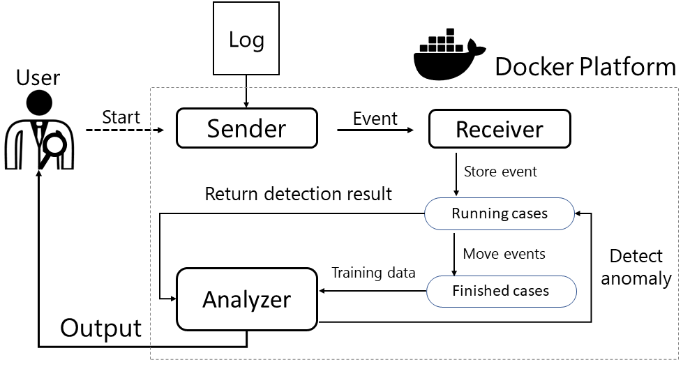

# PAD: A predictive anomaly detection tool for event streams

This project implements a web-based application for online Predictive Anomaly Detection (PAD) in process mining. Our tool is witten in Python using Flask and Docker Platform. At the moment, the tool contains three components with the following architecture.



- Add_new_event
  -   In this application, you can simulate the event streams and set the anomalous threshold. New events are distributed to the network according to the given even log.

- Event_generator (_Sender_)
  - This application sends a new event to the _Receiver_ through the exposed API.

- Analyzer (_Receiver_ & _Analyzer_)
  - This application operates as the _Receiver_ and the _Analyzer_. The _Receiver_ obtains an event from the previous application, the _Sender_, and manages two repositories. The two repositories contains the running cases events and finished cases events. The events of the finished cases are pre-processed for model training. The _Analyzer_ detects the anomalous events using predictive anomaly detection approach. The approach is proposed in the paper [The Analysis of Online Event Streams: Predicting the Next Activity for Anomaly Detection](https://scholar.google.com/citations?view_op=view_citation&hl=ko&user=wu98U7EAAAAJ&citation_for_view=wu98U7EAAAAJ:uWQEDVKXjbEC).

## Requirements
You need to install Docker platform and Python. The required Python packages for each components are specified in the requirements file.

## Usage
To use the application, a Docker container should be created to run the components on the local environment. As well as creating the Docker containers, the virtual network is set to connect web-applications based on Flask. The code for making docker containers is as follows:

```
docker-compose up --build -d
```

The code to simulate the event streams is as follows:

```
python add_new_event.py -m streaming
```

The code to stop simulate the streams and obtain the anomalous event results is as follows:

```
python add_new_event.py -m stop
```

## Tutorial video
In this video, you can watch a demonstration of the tool which introduces the main features and the how to use the tool step-by-step.
[](https://www.youtube.com/watch?v=HGc3ychFVuk)